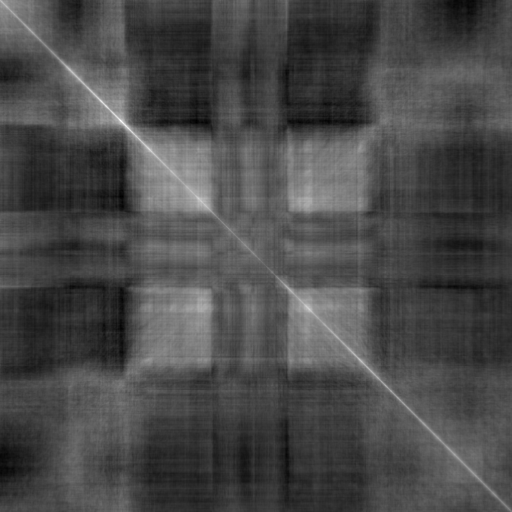
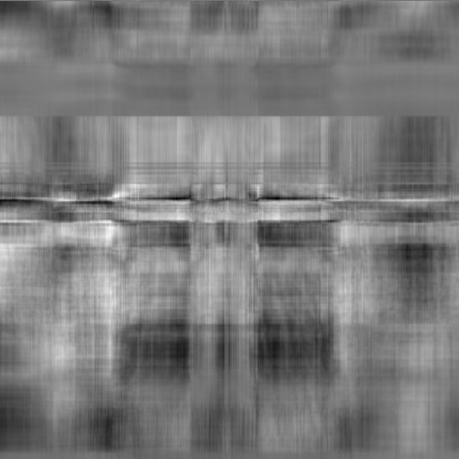

## Commentrary to "Multplying monochrome images as matrices"

We obtained images like

and

via matrix multiplication.

View the Julia Jupyter notebook in question via this link:

https://nbviewer.jupyter.org/github/anhinga/github-tests/blob/main/Untitled.ipynb

(The notebook itself is at https://github.com/anhinga/github-tests/blob/main/Untitled.ipynb
there is a GitHub bug preventing some Jupyter notebook from rendering correctly, so
one has to use `nbviewer` or its equivalent.)

This is the first notebook in this study, it was created on December 8, 2020 with Julia 1.5.2
on Windows 10. I verified that all this still works with Julia 1.6.0 (but much faster, and
the warning in cell 1 is gone, which is good).

The sketch of the talk proposal itself is at https://github.com/anhinga/julia-notebooks/blob/main/images-as-matrices/presentation/talk-proposal.md

We discuss a bit of machine learning context at the bottom of this file

Cell 3: read "mandrill" standard test image

Cell 4: make it monochrome

Cell 5: `im1 = 1*img` - a hack to convert this to `Array{Gray{Float32},2}`

`im1 = convert(Array{Gray{Float32}, 2}, img)` would produce the same result

Cell 8: transposed "mandrill"

Cell 42: `normalize_image` is doing the same transform as `ImageView.imshow` methods

Cell 43: multiply transposed "mandrill" by "mandrill", and show the normalized result (plenty of information in that product, but not an "excessively artistic" image)

Cell 45: read standard "jetplane" test image

Cell 51: remove alpha channel, and make it `Array{Gray{Float32},2}`, as in cell 5 above

Cell 53: multiply "jetplane" by "mandrill", and show the normalized result (plenty of information in that product, but not an "excessively artistic" image)

Cell 76: a relatively naive version of `softmax` (softmax matrix columns with the default call)

Cell 77: one of the possible ways to softmax matrix rows 

`softmax` does lose `Gray` image type, so it needs to be added back for the purpose of rendering, as one sees in the following cells.

Cell 79: softmax rows in "jetplane" (you see horizontal stripes on the resulting image)

Cell 80: softmax columns in "mandrill" (you see vertical stripes on the resulting image)

Cell 81: transpose that "mandrill" (the transposed image has softmaxed rows, you see horizontal stripes)

Cell 82: multiply the result of Cell 81 by the result of Cell 80, and show the normalized result (now we see plenty of interesting fine structure, and the result is quite artistic)

Cell 83: multiply the result of Cell 79 by the result of Cell 80, and show the normalized result (now we see plenty of interesting fine structure, and the result is quite artistic)

---

Machine learning context.

1) Looking at page 4 of the famous "Attention Is All You Need" paper introducing the Transformer architecture: https://arxiv.org/abs/1706.03762

Look at formula 1 for Scaled Dot-Product Attention. The softmax is applied to each row of the left-hand-side matrix before taking the final matrix product.

In our case, we found that for visually interesting results, one also needs to apply softmax to the columns of the right-hand-side matrix.

(It would certainly be interesting to try modify Transformers in this fashion, but one needs to be able to train some Transformers at the first place.
Then one could investigate, whether this change would be an improvement.)

2) 
